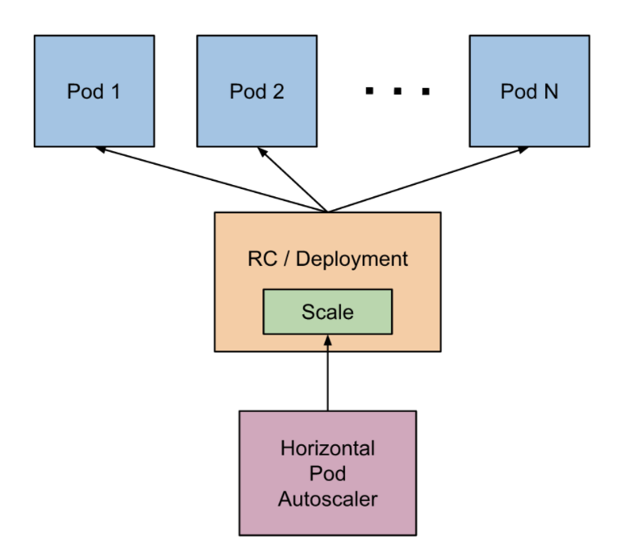

<!-- START doctoc generated TOC please keep comment here to allow auto update -->
<!-- DON'T EDIT THIS SECTION, INSTEAD RE-RUN doctoc TO UPDATE -->
**Table of Contents**  *generated with [DocToc](https://github.com/thlorenz/doctoc)*

- [Introduction](#introduction)
- [Kubernetes Horizontal Pod Autoscaler](#kubernetes-horizontal-pod-autoscaler)
  - [Autoscale using HPA](#autoscale-using-hpa)
  - [Readings](#readings)
- [Kubernetes Volume](#kubernetes-volume)
  - [Using volume](#using-volume)
  - [Readings](#readings-1)
- [Kubernetes PV & PVC](#kubernetes-pv--pvc)
  - [Using PV & PVC](#using-pv--pvc)
  - [Readings](#readings-2)
- [Kubernetes StorageClass](#kubernetes-storageclass)
  - [Using StorageClass](#using-storageclass)
  - [Default StorageClass](#default-storageclass)
  - [StorageClass Provisioner](#storageclass-provisioner)
  - [Readings](#readings-3)
- [Exercise](#exercise)

<!-- END doctoc generated TOC please keep comment here to allow auto update -->

# Introduction

本节我们将了解更多 kubernetes 的概念，主要包括水平扩容和存储模型。

# Kubernetes Horizontal Pod Autoscaler

## Autoscale using HPA

HorizontalPodAutoscaler，简称 HPA，通过监控应用的 CPU 使用率动态调整 Pod 的数量（Pod 必须是由 Deployment
或 RC 创建）。下图表明了 HPA 的工作原理：

<p align="center"></p>
<p align="center"><i>Image source: kubernetes guide</i></p><br>

可以看到，HPA 通过调整 Deployment 的副本数量来动态调整 Pod 数量。使用 HPA 需要设置 CPU 使用率阈值、最大最小
Pod 数量等。这里我们先创建一个只有一个副本的 Deployment，然后逐渐加压，观察副本的变化情况。首先，
请确保没有运行中的应用，如果有，可以使用下述命令删除：

```
kubectl delete deploy <deployment-name>
kubectl delete ds <daemonset-name>
kubectl delete job <job-name>
kubectl delete pod <pod-name>
```

然后，创建一个 replica 数量为 1 的 Deployment，并使用 Service 暴露服务：

```
$ kubectl run nginx --image=cargo.caicloud.io/caicloud/nginx:1.9.7 --requests="cpu=100m,memory=256Mi" --limits="cpu=200m,memory=512Mi" --expose --port=80
service "nginx" created
deployment "nginx" created

$ kubectl get pods -o wide
NAME                     READY     STATUS    RESTARTS   AGE       IP           NODE
nginx-1054067713-jmpx3   1/1       Running   0          4m        172.17.0.5   minikube

$ kubectl get svc -o wide
NAME         TYPE        CLUSTER-IP   EXTERNAL-IP   PORT(S)   AGE       SELECTOR
kubernetes   ClusterIP   10.0.0.1     <none>        443/TCP   23m       <none>
nginx        ClusterIP   10.0.0.116   <none>        80/TCP    4m        run=nginx
```

当所有的应用正常运行后，我们开始创建 HPA。在创建 HPA 之前，我们需要部署监控插件 - kubernetes
依赖监控组件来判断应用的资源使用情况。kubernetes 的默认监控插件是 heapster + influxdb，默认情况下
minikube 关闭了监控插件，可以通过下面的命令打开：

```
$ minikube addons enable heapster
heapster was successfully enabled

$ kubectl get pods
NAME                          READY     STATUS    RESTARTS   AGE
nginx-1054067713-jmpx3        1/1       Running   0          18m
```

下面的命令将 CPU 利用率的阈值定义在 10%，即 HPA 会尽量维护所有 Pod CPU 利用率加起来不超过 10%。
因为我们在创建 Deployment 的时候请求的 CPU 资源是 100m，因此 HPA 会将使用量维持在 10m。

```
$ kubectl autoscale deployment nginx --cpu-percent=10 --min=1 --max=5
deployment "nginx" autoscaled

$ kubectl get hpa
NAME      REFERENCE          TARGETS    MINPODS   MAXPODS   REPLICAS   AGE
nginx     Deployment/nginx   0% / 10%   1         5         1          15m
```

从 HPA 输出可以看出，当前的 CPU 利用率为 0%，而我们设定的利用率为 10%。接下来我们向容器增加压力。

```
$ minikube ssh
$ while true; do curl -s 10.0.0.116 > /dev/null; done
```

经过一段时间后，当前使用率增加到 13%，HPA 将容器扩容至 2 个：

```
$ kubectl get hpa
NAME      REFERENCE          TARGETS     MINPODS   MAXPODS   REPLICAS   AGE
nginx     Deployment/nginx   13% / 10%   1         5         2          21m

$ kubectl get pods
NAME                     READY     STATUS    RESTARTS   AGE
nginx-1054067713-3r9bt   1/1       Running   0          3m
nginx-1054067713-jmpx3   1/1       Running   0          34m
```

关闭加压命令后，HPA 会将 Pod 数量重新调整为 1 个。

注意，目前为止（kubernetes 1.7），官方只支持基于 CPU 的自动扩缩容，基于 Memory 和自定义指标的扩缩容有社区方案，
但并非官方提供。最后，清理现场。


```
$ kubectl delete deployment nginx
deployment "nginx" deleted

$ kubectl delete hpa nginx
horizontalpodautoscaler "nginx" deleted
```

## Readings

- [kubernetes horizontal pod autoscale](https://kubernetes.io/docs/tasks/run-application/horizontal-pod-autoscale/)
- [horizontal pod autoscale walkthrough](https://kubernetes.io/docs/tasks/run-application/horizontal-pod-autoscale-walkthrough/)

# Kubernetes Volume

## Using volume

用户可以通过 Volume 来创建数据卷，使用数据卷之后，用户创建的 Pod 可以外部存储空间。Volume 是一个广义的概念，
在 kubernetes 中至少包含三种类型：

- 临时存储，比如 EmptyDir。当 Pod 删除后，EmptyDir Volume 也会被随之删除。
- 持久化存储，比如 Ceph。kubernetes 通过 Volume 的方式挂载外部持久化存储。
- 映射类存储，比如 ConfigMap。此类存储基于其他存储类型，为 Pod 提供元数据，配置等信息。

无论是那种类型，都可以在 Pod 中直接指定 Volume 的信息。接下来我们创建一个最简单的 Pod，使用 EmptyDir 作为
Volume。可以看到，kubernetes 根据 yaml 文件的内容，为该 Pod 挂载了一个 cache 目录。对于 EmptyDir 而言，
该目录的本质就是宿主机上的一个目录。

```
$ kubectl create -f resources/emptydir_pod.yaml
pod "emptydir-pod" created

$ kubectl get pods
NAME           READY     STATUS    RESTARTS   AGE
emptydir-pod   1/1       Running   0          4s

# look into emptydir-pod and create a file
$ kubectl exec -it emptydir-pod bash
root@emptydir-pod:/# ls cache/
root@emptydir-pod:/# touch cache/abc

$ kubectl get pods emptydir-pod -o yaml | grep uid
  uid: 56eda99b-a268-11e7-b31d-080027ed8d11

# we'll be able to see the file from host side
$ minikube ssh
$ sudo ls /var/lib/kubelet/pods/56eda99b-a268-11e7-b31d-080027ed8d11/volumes/kubernetes.io~empty-dir/cache-volume
abc
```

可以验证，当 Pod 被删除后，数据也就丢失了。若我们想使存储与 Pod 的生命周期解耦，需要使用网络存储。如果我们查看
emptydir_pod.yaml 文件，可以看到使用方法和 ConfigMap 和 Secret 完全类似。

## Readings

- [kubernetes volumes](https://kubernetes.io/docs/concepts/storage/volumes/)

# Kubernetes PV & PVC

## Using PV & PVC

对于持久化存储，Kubernetes 抽象出了 PersistentVolume (PV) 和 PersistentVolumeClaim (PVC) 两类资源。
类似于 Node 与 Pod 在计算资源上的关系，PV/PVC 提供了存储的抽象。管理员创建可用的存储资源（PV），用户通过 PVC
请求需要的资源再与 Pod 进行绑定。接下来，我们感受一下如何使用 PV 和 PVC。

首先，我们需要创建新的 PV。类比于节点，可以理解为是向集群中添加节点，这里我们创建一个基于 hostPath 的 PV。基于
hostPath 的 PV 主要用来做测试，生产环境中一般采用其他存储方案如 NFS, GlusterFS, Ceph 等。

```
$ kubectl create -f resources/pv_hostpath.yaml
persistentvolume "pv-hostpath" created

$ kubectl get pv
NAME          CAPACITY   ACCESSMODES   RECLAIMPOLICY   STATUS      CLAIM     STORAGECLASS   REASON    AGE
pv-hostpath   10Gi       RWX           Recycle         Available                                      1m
```

创建 PV 之后，我们需要申请使用 PV，因此需要在 kubernetes 中创建 PVC。

```
$ kubectl create -f resources/pvc.yaml
persistentvolumeclaim "myclaim" created
```

kubernetes 根据 PVC 所需的容量（resources.requests.storage）和访问方式（accessMode）来调度存储资源。
如下所示，我们创建的 PV 和 PVC 被 kubernetes 绑定在了一起。

```
$ kubectl get pv
NAME          CAPACITY   ACCESS MODES   RECLAIM POLICY   STATUS    CLAIM             STORAGECLASS   REASON    AGE
pv-hostpath   10Gi       RWX            Recycle          Bound     default/myclaim   standard                 9s

$ kubectl get pvc
NAME      STATUS    VOLUME        CAPACITY   ACCESS MODES   STORAGECLASS   AGE
myclaim   Bound     pv-hostpath   10Gi       RWX            standard       4s
```

PV 和 PVC 的封装主要作用是达到了平台可移植性。应用不再需要关系底层存储的细节，只需要使用 PVC 即可。
接下来我们使用上面的 PVC 来创建应用。

```
$ kubectl create -f resources/pod_with_pvc.yaml
pod "pod-with-pvc" created

$ kubectl get pods
NAME           READY     STATUS    RESTARTS   AGE
pod-with-pvc   1/1       Running   0          2s

$ kubectl exec -it pod-with-pvc bash
root@pod-with-pvc:/# touch /var/www/html/index.html

$ minikube ssh
$ ls /tmp/data1/
index.html
```

当我们删除 Pod 时，PV 和 PVC 的绑定不受任何影响，意味着我们可以重新创建 Pod 使用 PVC，数据仍然存在。

```
$ kubectl delete pod pod-with-pvc
pod "pod-with-pvc" deleted

$ kubectl get pvc
NAME      STATUS    VOLUME        CAPACITY   ACCESS MODES   STORAGECLASS   AGE
myclaim   Bound     pv-hostpath   10Gi       RWX            standard       5m

$ kubectl get pv
NAME          CAPACITY   ACCESS MODES   RECLAIM POLICY   STATUS    CLAIM             STORAGECLASS   REASON    AGE
pv-hostpath   10Gi       RWX            Recycle          Bound     default/myclaim   standard                 5m
```

如果进一步删除 PVC，可以看到 PV 进入了 `Released` 状态，这意味着 PV 已经被释放，但是还无法被重新使用，
需要管理员手动清理 PV 数据后，将 PV 状态修改为 `Available`。PV 进入 `Release` 状态的原因是 PV
的回收策略被指定为 `Recycle`（spec.persistentVolumeReclaimPolicy: Recycle）。如果将回收策略改为
`Delete`，那么 PV 会被 kubernetes 直接删除。

```
$ kubectl delete pvc myclaim
persistentvolumeclaim "myclaim" deleted

$ kubectl get pv
NAME          CAPACITY   ACCESS MODES   RECLAIM POLICY   STATUS     CLAIM             STORAGECLASS   REASON    AGE
pv-hostpath   10Gi       RWX            Recycle          Released   default/myclaim   standard                 7m
```

PV 可以被手动删除，kubernetes 不会自动清理底层的数据。

```
$ kubectl delete pv pv-hostpath
persistentvolume "pv-hostpath" deleted
```

## Readings

- [Kubernetes Persistent Volume](https://kubernetes.io/docs/concepts/storage/persistent-volumes/)
- [How to Use Persistent Volume](https://kubernetes.io/docs/tasks/configure-pod-container/configure-persistent-volume-storage/)

# Kubernetes StorageClass

## Using StorageClass

从上述操作的步骤可以看出，管理员需要首先创建 PV 才能让用户使用底层存储。其次，用户在使用 PVC 申请存储的时候，
只能指定存储空间大小和访问模式。假如底层同时提供 GlusterFS 和 NFS，或者是不同规格的 GlusterFS，
用户并没有能力指定特定的存储系统。从 1.2 版本开始，Kubernetes 逐渐引入了 StorageClass 的概念来解决上述两个问题。

首先，我们需要创建 StorageClass。minikube 自带一个基于 hostPath 类型的 StorageClass，如下所示。

```
$ kubectl get storageclass standard -o yaml
apiVersion: storage.k8s.io/v1
kind: StorageClass
metadata:
  annotations:
    ..
    storageclass.beta.kubernetes.io/is-default-class: "true"
  creationTimestamp: 2017-09-26T01:22:01Z
  labels:
    addonmanager.kubernetes.io/mode: Reconcile
  name: standard
  resourceVersion: "140"
  selfLink: /apis/storage.k8s.io/v1/storageclasses/standard
  uid: 1930c2aa-a259-11e7-b31d-080027ed8d11
provisioner: k8s.io/minikube-hostpath
```

minikube 自带的 StorageClass 的名字为 `standard`，provisioner 名字为 `k8s.io/minikube-hostpath`。
当我们创建一个 PVC 时，需要指定所需要的 StorageClass 名字，例如：

```
kind: PersistentVolumeClaim
apiVersion: v1
metadata:
  name: claim-standard
spec:
  storageClassName: standard
  accessModes:
    - ReadWriteOnce
  resources:
    requests:
      storage: 8Gi
```

上述 PVC 将会使用 `standard` StorageClass 创建一个 PV，如下所示：

```
$ kubectl get pvc
NAME      STATUS    VOLUME                                     CAPACITY   ACCESSMODES   STORAGECLASS   AGE
myclaim   Bound     pvc-207c1e0b-a341-11e7-bf8e-0800277a7b6e   8Gi        RWX           standard       6s

$ kubectl get pv
NAME                                       CAPACITY   ACCESSMODES   RECLAIMPOLICY   STATUS    CLAIM             STORAGECLASS   REASON    AGE
pvc-207c1e0b-a341-11e7-bf8e-0800277a7b6e   8Gi        RWX           Delete          Bound     default/myclaim   standard                 8s
```

可以看到 Kubernetes 自动生成了一个 PV。注意，动态生成的 PV 其回收属性是 `Delete`，即删除 PVC 会将 PV
也同时删除：

```
$ kubectl delete pvc myclaim
persistentvolumeclaim "myclaim" deleted

$ kubectl get pvc
No resources found.

$ kubectl get pv
No resources found.
```

## Default StorageClass

kubernetes 集群中可以创建多个 StorageClass，其中有且仅有一个默认 StorageClass。当创建的 PVC 没有指定
需要什么类型的存储时（即 pvc.spec.storageClassName 为空），Kubernetes 使用默认 StorageClass。

在 minikube 环境中，`standard` 即为默认的 StorageClass。我们在 PV & PVC 章节中创建的 PVC 没有指定
storageClassName，因此默认使用 `standard`。

```
$ kubectl get storageclass
NAME                 TYPE
standard (default)   k8s.io/minikube-hostpath
```

## StorageClass Provisioner

除了名字之外，每一个 StorageClass 都必须指明 provisioner。provisioner 是真正创建底层存储的组件。provisioner
负责监听一个特定的事件 - “用户创建了一个 PVC，该 PVC 使用某个 StorageClass，该 StorageClass 的 provisioner
是我自己”。当发生该事件，provisioner 将会创建底层存储。例如：

```
apiVersion: storage.k8s.io/v1
kind: StorageClass
metadata:
  name: gluster-class
  annotations:
    storageclass.kubernetes.io/is-default-class: "false"
provisioner: example.com/gluster
```

当用户创建一个 PVC 使用 `gluster-class`，名为 `example.com/gluster` 的 provisioner 需要创建基于 GlusterFS
的 PV 供 PVC 使用。一般情况下，provisioner 以 Pod 形式运行在 kubernetes 集群中，长运行并监听上述事件。
provisioner 的稳定性和健壮性是极为重要的，否则动态创建会失效。

## Readings

- [kubernetes dynamic provisioning in 1.4](http://blog.kubernetes.io/2016/10/dynamic-provisioning-and-storage-in-kubernetes.html)
- [kubernetes dynamic provisioning in 1.6](http://blog.kubernetes.io/2017/03/dynamic-provisioning-and-storage-classes-kubernetes.html)

# Exercise

1. 查找资料，学习思考基于内存或自定义指标实现扩缩容的方案
2. 搭建一个 nfs 服务器，创建 StorageClass，学习使用 PV & PVC
